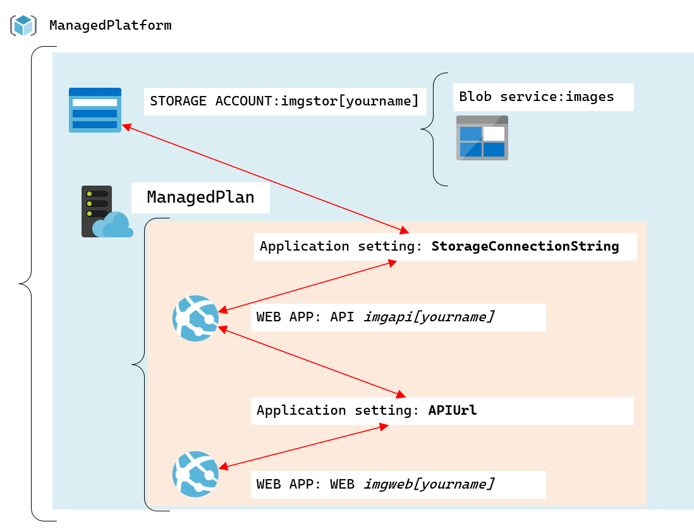
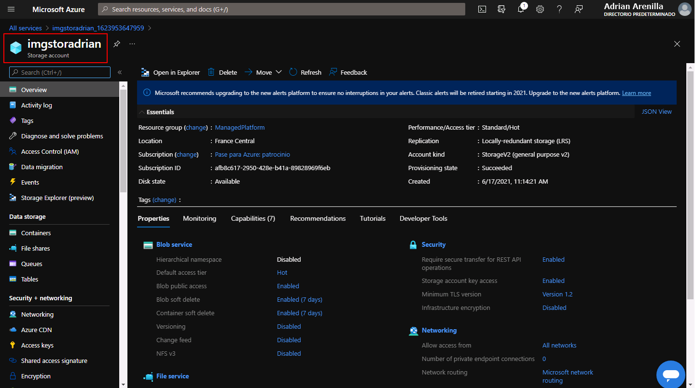
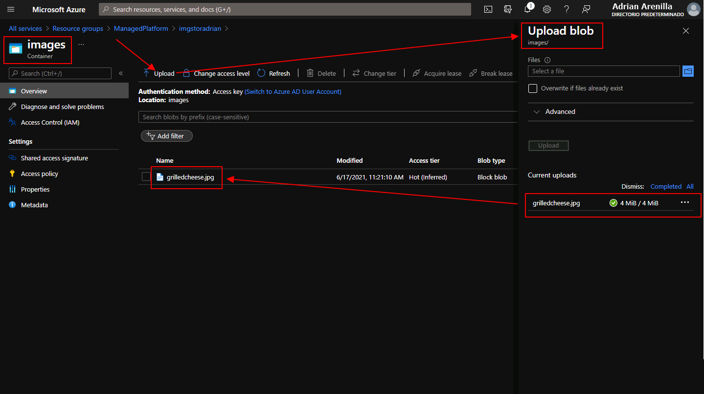
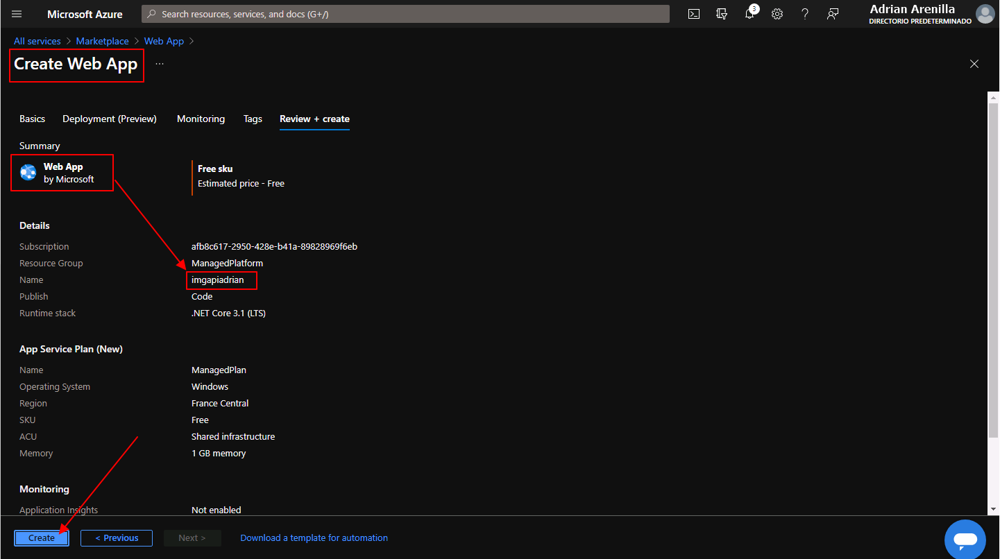
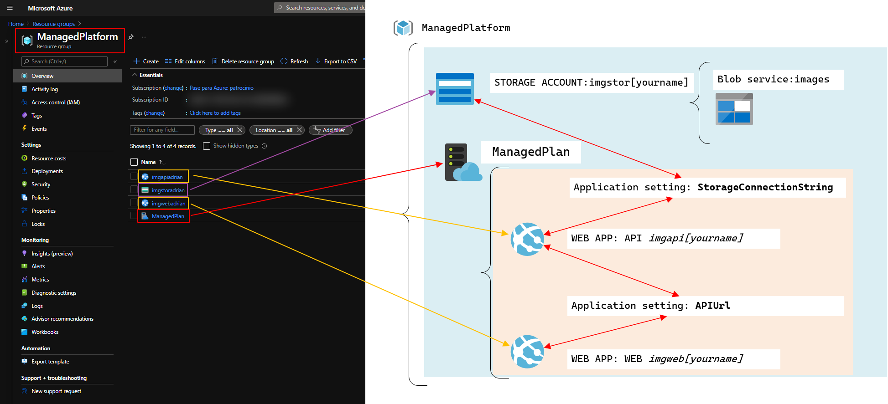

# Microsoft Az-204 (Adrián Arenilla Seco)

## Lab 01: Building a web application on Azure platform as a service offerings
In this lab we will learn to create applications using App Service, deploy applications using Kudu, Azure command line interface (CLI) and zip file deployment.

### [Go to lab instructions -->](Files/AZ-204_01_lab.md)

## Working Architecture


Create a storage account.



Upload a sample blob.


Upload a image into a sample blob.



Create a web app defining its SKU (Stock-Keeping Unit) and size.


Review and create a web app.


Create web app.



Configure the web app.


Deploy an ASP.NET web application to Web Apps. Enter the following command to sign in to the Azure Command-Line Interface (CLI): 
```
az login 
```


Enter the following command to list all the apps in your ManagedPlatform resource group:
```
az webapp list --resource-group ManagedPlatform
```


Enter the following command to deploy the api.zip file to the web app that you created earlier in this lab:
```
az webapp deployment source config-zip --resource-group ManagedPlatform --src api.zip --name imgapiadrian
```


Perform a GET request to the root of the website, and then observe the JavaScript Object Notation (JSON) array that's returned. This array should contain the URL for your single uploaded image in your Storage account.


Build a front-end web application by using Azure Web Apps. Create a web app.


Configure a web app.


Deploy an ASP.NET web application to Web Apps. Enter the following command to display in a table all the apps in your ManagedPlatform resource group:
```
az webapp list --resource-group ManagedPlatform --output table
```


Enter the following command to deploy the web.zip file to the web app that you created earlier in this lab:
```
az webapp deployment source config-zip --resource-group ManagedPlatform --src web.zip --name imgwebadrian
```


Observe the list of images in the gallery. The gallery should list a single image that was uploaded to Storage earlier in the lab.


Observe that the list of gallery images has updated with your new image.


Create all lab resources.



Enter the following command to delete the ManagedPlatform resource group:
```
az group delete --name ManagedPlatform --no-wait --yes
```


### [<-- Back to readme](../../../../readme.md)

