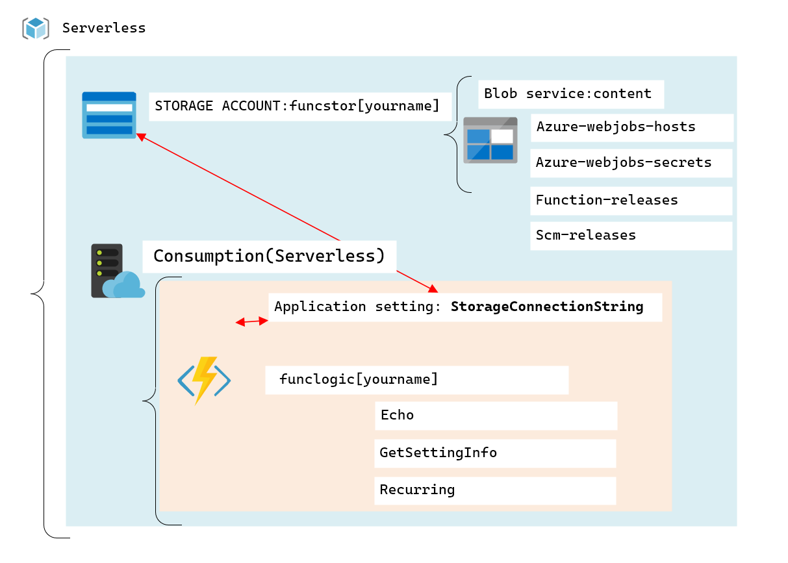
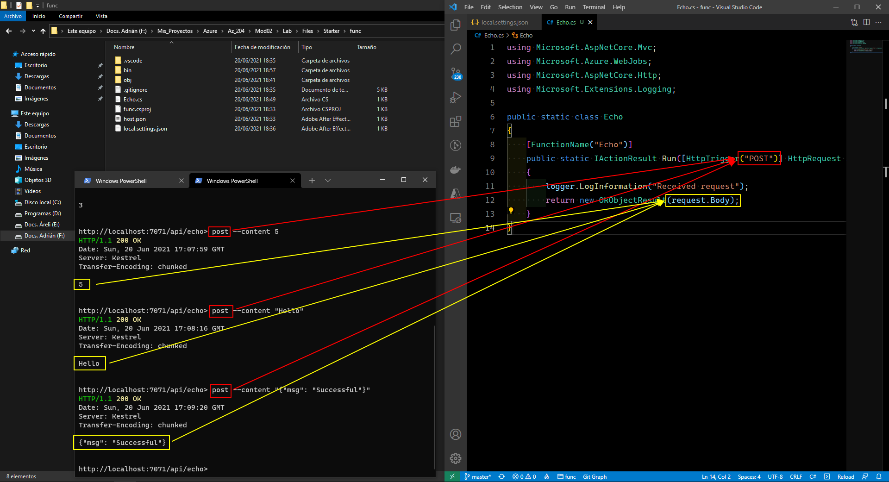
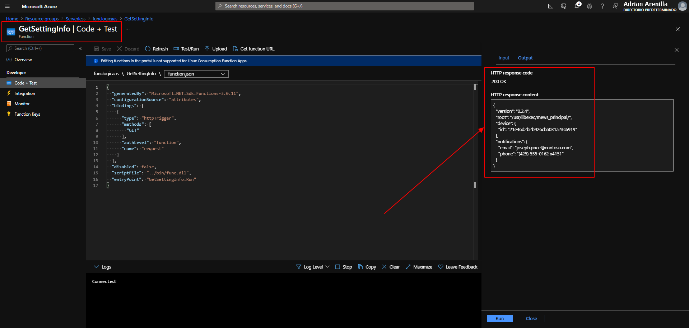

# Microsoft Az-204 (Adrián Arenilla Seco)

## Lab 02: Implement task processing logic by using Azure Functions
In this lab we will learn how to create an Azure Functions application, create a local Azure Functions project with its core tools and create multiple functions using built-in triggers and input integrations.

### [Go to lab instructions -->](Files/AZ-204_02_lab.md)

## Working Architecture


Create a storage account.


Storage account created.


Function app in marketplace.


Create function app.


Function app created.


Enter the following command to use the Azure Functions Core Tools to create a new local Azure Functions project in the current directory using the dotnet runtime:
```
func init --worker-runtime dotnet --force
```


Update the value of the AzureWebJobsStorage by setting it to the connection string.


Enter the following command to build the project:
 ```
 dotnet build
 ```


Enter the following command to use the Azure Functions Core Tools to create a new function named Echo using the HTTP trigger template:
```
func new --template "HTTP trigger" --name "Echo"
```


Update the content of the Echo.cs file.


Enter the following command to run the function app project:
```
func start --build
```


Enter the following command to start the httprepl tool setting the base Uniform Resource Identifier (URI) to ``http://localhost:7071``:
```
httprepl http://localhost:7071
```


Enter the following command to run the post command that sends an HTTP request body set to a numeric value or a text string using the \ - \ - content option:

```
post --content 3
```
```
post --content 5
```
```
post --content "Hello"
```
```
post --content "{"msg": "Successful"}"
```


Post and body of the file when executing the template.



Request received correctly.


Enter the following command to use the Azure Functions Core Tools to create a new function named Recurring using the Timer trigger template:
```
func new --template "Timer trigger" --name "Recurring"
```


Enter the following command to run the function app project:
```
func start --build
```


Update the content of the Recurring.cs file.


Enter the following command to run the function app project:
```
func start --build
```


Upload sample content to Azure Blob Storage.


Enter the following command to use the Azure Functions Core Tools to create a new function named GetSettingInfo using the HTTP trigger template:
```
func new --template "HTTP trigger" --name "GetSettingInfo"
```


After updating the GetSettingInfo.cs file install the Nuget "Storage" extension.
```
func extensions install --package Microsoft.Azure.WebJobs.Extensions.Storage
```


Correct compilation.


Enter the following command to validate the extensions were installed correctly by building the .NET project:
```
dotnet build
```


First enter the following command to run the function app project:
```
func start --build
```
After enter the following command to start the httprepl tool setting the base Uniform Resource Identifier (URI) to ``http://localhost:7071``:
```
httprepl http://localhost:7071
```


Enter the following command to publish the function app project:
```
func azure functionapp publish funclogicaas
```


Validate deployment.


The results of the test run in JSON format.



Enter the following command to delete the Serverless resource group:
```
az group delete --name Serverless --no-wait --yes
```


### [<-- Back to readme](../../../../)