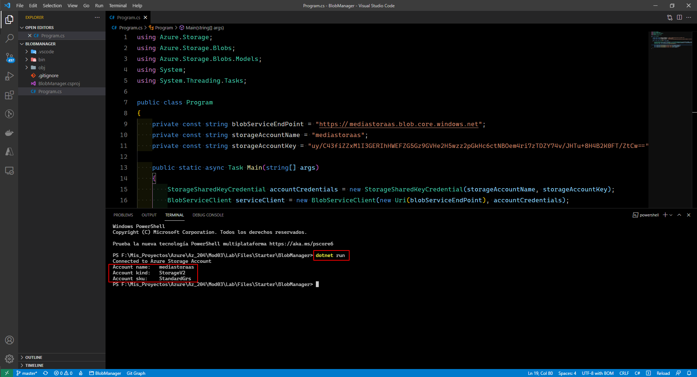
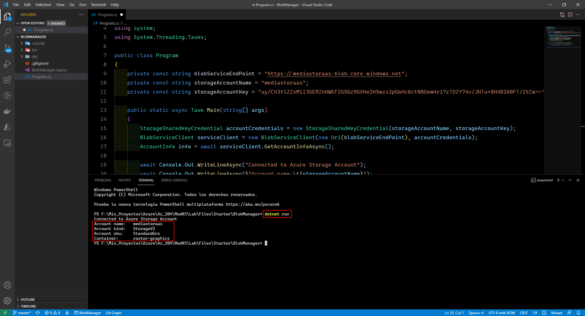
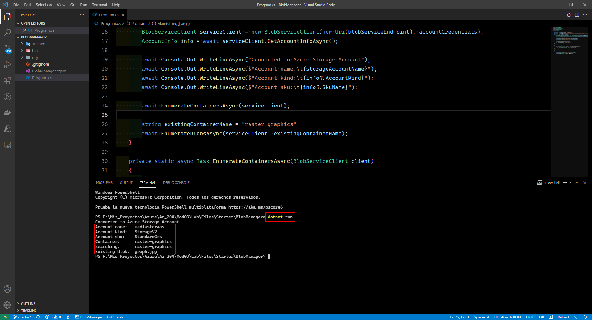

# Microsoft Az-204 (Adrián Arenilla Seco)

## Lab 03: Retrieving Azure Storage resources and metadata by using the Azure Storage SDK for .NET
In this lab we will learn how to containerize and upload blobs using the Azure portal, enumerate blobs and containers with the Microsoft Azure Storage SDK for .NET and extract blob metadata with the Storage SDK.

### [Go to lab instructions -->](Files/AZ-204_03_lab.md)

## Working Architecture


Create a storage account.


Create storage account containers.


Upload a blob into a container.


Enter the following command to create a new .NET project named BlobManager in the current folder:
```
dotnet new console --name BlobManager --output .
```


Enter the following command to import Azure.Storage.Blobs from NuGet:
```
dotnet add package Azure.Storage.Blobs
```


Enter the following command to build the .NET web application:
```
dotnet build
 ```


Modify the Program class to access Storage.


Enter the following command to run the .NET web application:
```
dotnet run
```



Update Program class to enumerate the existing containers.


Enter the following command to run the .NET web application:
```
dotnet run
```



Update de Program class to enumerate the blobs in an existing container by using the SDK and enter the following command to run the .NET web application:
```
dotnet run
```



Update de Program class to create a new container by using the SDK and enter the following command to run the .NET web application:
```
dotnet run
```


In the Containers section, we have the newly created vector graphics container.


Upload a new blob by using the portal.


Update the Program class to create an access blob URI by using the SDK and enter the following command to run the .NET web application:
```
dotnet run
```


We access the updated URL to access the online blob.


Enter the following command to delete the StorageMedia resource group:
```
az group delete --name StorageMedia --no-wait --yes
```


### [<-- Back to readme](../../../../)


