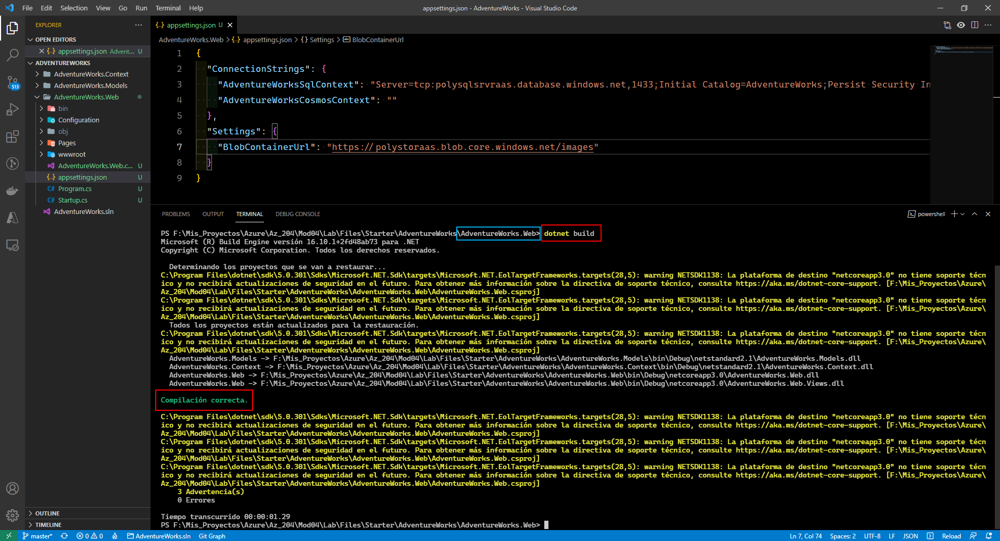
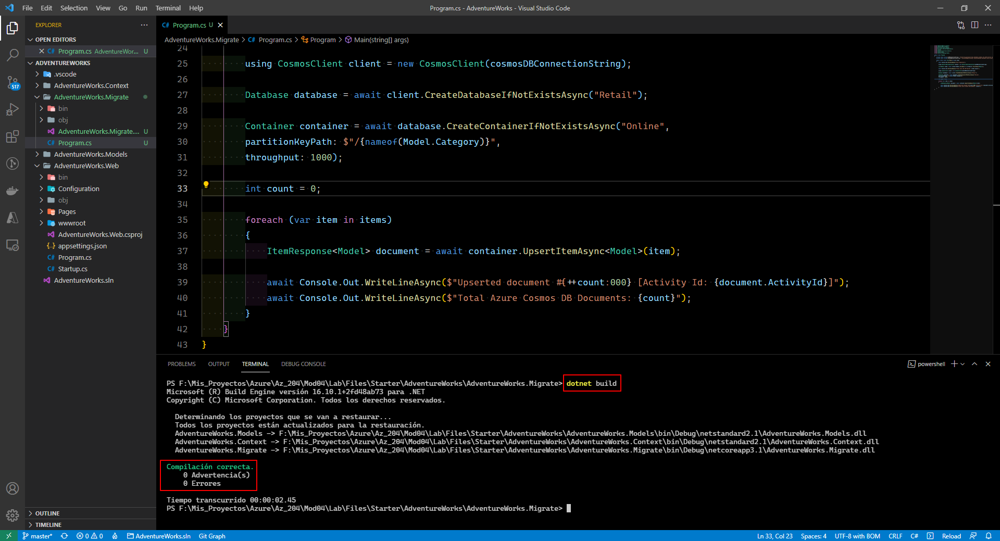
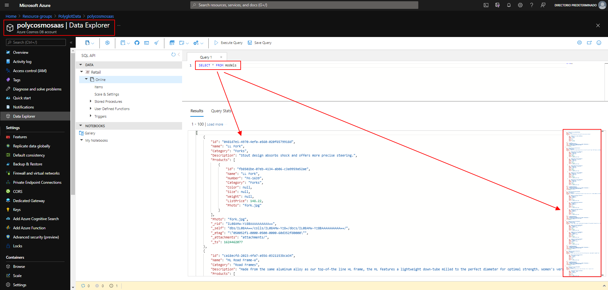

# Microsoft Az-204 (Adrián Arenilla Seco)

## Lab 04: Constructing a polyglot data solution
In this lab we will learn how to instantiate multiple database services using the Azure portal, write C# code to connect to the SQL database and write C# code to connect to Azure Cosmos DB.

### [Go to lab instructions -->](Files/AZ-204_04_lab.md)

## Working Architecture


Create an Azure SQL Database server resource.


Create an Azure Cosmos DB account resource.


Create an Azure Storage account resource.


Create storage account containers.


Upload a blob into a container.


Create storage account containers.


Upload a blob into a container.


Import an SQL database.


This step ensures that the local machine has access to the databases associated with this server.


Enter the following query to view all the data in the models table.
```
SELECT * FROM AdventureWorks.dbo.Models
```


Enter the following query to view all the data in the products table.
```
SELECT * FROM AdventureWorks.dbo.Products
```


Enter the following command to build the .NET web application:
```
dotnet build
```


Update the JSON file.
Enter the following command to switch your terminal context to the AdventureWorks.Web folder:
```
cd .\AdventureWorks.Web\
```

Enter the following command to run the .NET web application:
```
dotnet build
```



Go to the following address to see the result currently obtained (<http://localhost:5000>).


Go to the water bottle and visualize the result.


Enter the following command to create a new .NET console project named AdventureWorks.Migrate:
```
dotnet new console --name AdventureWorks.Migrate --framework netcoreapp3.1
```


Enter the following command to add a reference to the existing AdventureWorks.Models project:
```
dotnet add .\AdventureWorks.Migrate\AdventureWorks.Migrate.csproj reference .\AdventureWorks.Models\AdventureWorks.Models.csproj
```


Enter the following command to add a reference to the existing AdventureWorks.Context project:
```
dotnet add .\AdventureWorks.Migrate\AdventureWorks.Migrate.csproj reference .\AdventureWorks.Context\AdventureWorks.Context.csproj
```


First enter the following command to switch your terminal context to the AdventureWorks.Migrate folder:
```
cd .\AdventureWorks.Migrate\
```

After enter the following command to import Microsoft.EntityFrameworkCore.SqlServer from NuGet:
```
dotnet add package Microsoft.EntityFrameworkCore.SqlServer
```


Enter the following command to import Microsoft.Azure.Cosmos from NuGet:
```
dotnet add package Microsoft.Azure.Cosmos
```


Enter the following command to build the .NET console application:
```
dotnet build
```


Update the Program class and enter the following command to switch your terminal context to the AdventureWorks.Migrate folder:
```
cd .\AdventureWorks.Migrate\
```
After enter the following command to build the .NET console application:
 ```
dotnet build
```


Update the Program class to get SQL database records by using Entity Framework and enter the following command to build the .NET console application:
```
dotnet build
```


Update the Program class to insert items into Azure Cosmos DB and enter the following command to build the .NET console application:
```
dotnet build
```



Enter the following command to perform a migration and run the .NET console application:
```
dotnet run
```


Enter the following command within the Azure Cosmos DB data explorer to view the results in the Azure portal:
```
SELECT * FROM models
```



Replace the existing text with the following text:
```
SELECT VALUE COUNT(1) FROM models
```


Enter the following command to import Microsoft.Azure.Cosmos from NuGet:
```
dotnet add package Microsoft.Azure.Cosmos
```


Enter the following command to build the .NET web application:
```
dotnet build
```


Update the AdventureWorksCosmosContext class to write .NET code to connect to Azure Cosmos DB and enter the following command to build the .NET web application:
```
dotnet build
```


Update the Startup class to update .NET application startup logic.


Validate that the .NET application successfully connects to Azure Cosmos DB.


Enter the following command to delete the PolyglotData resource group:
```
az group delete --name PolyglotData --no-wait --yes
```


### [<-- Back to readme](../../readme.md)


