# Microsoft Az-204 (Adrián Arenilla Seco)

## Lab 06: Authenticating to and querying Microsoft Graph by using MSAL and .NET SDKs
In this lab we will learn how to create a new application registry in Azure Active Directory (Azure AD), use the MSAL.NET library to implement the interactive authentication flow, obtain a token from the Microsoft identity platform using the MSAL.NET library and query the Microsoft Graph using the Microsoft Graph SDK and the device code flow.

### [Go to lab instructions -->](Files/AZ-204_06_lab.md)

## Working Architecture


Create an Azure Active Directory (Azure AD) application registration.
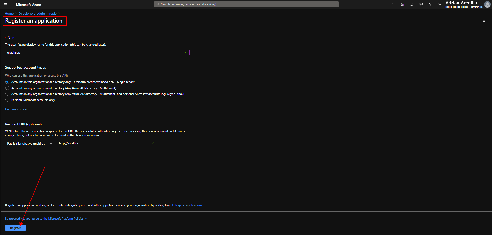


Enable the default client type.
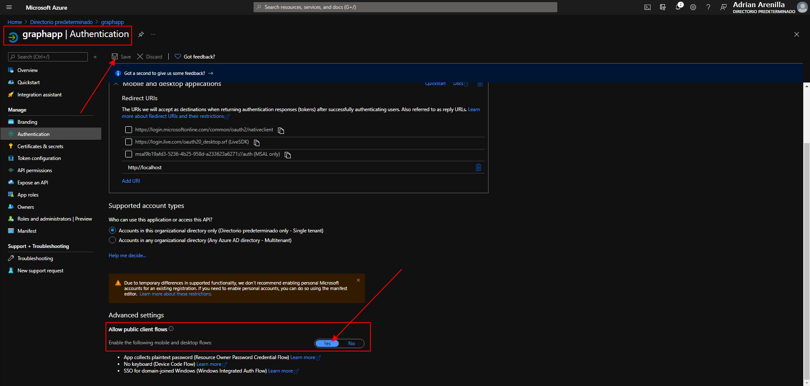


Enter the following command to create a new .NET project named GraphClient in the current folder:
```
dotnet new console --name GraphClient --output .
```
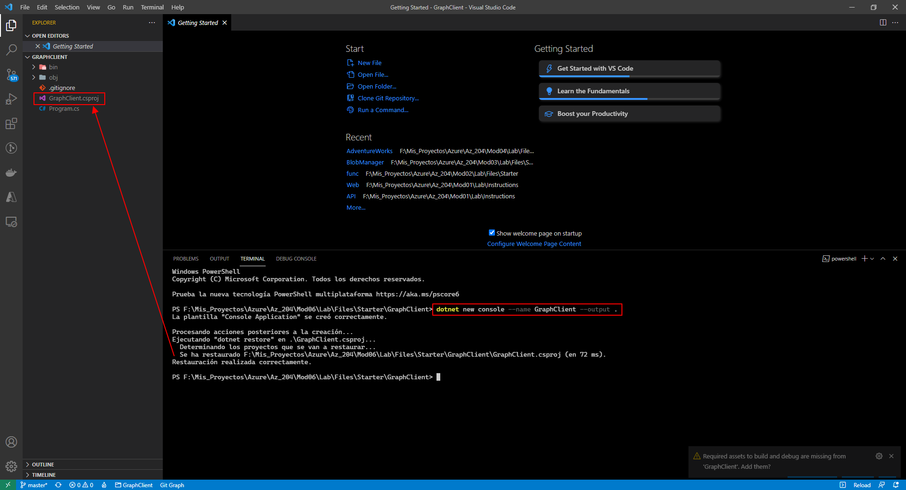


Enter the following command to import Microsoft.Identity.Client from NuGet:
```
dotnet add package Microsoft.Identity.Client
```
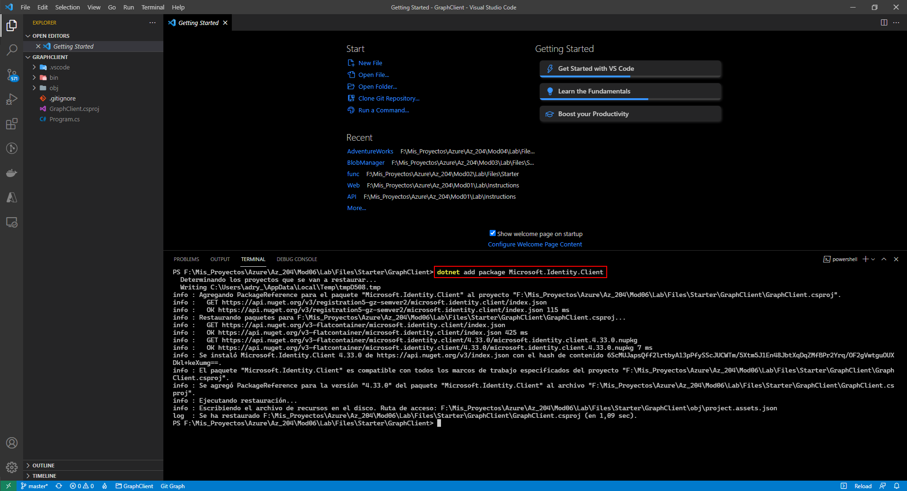


Enter the following command to build the .NET web application:
```
dotnet build
```
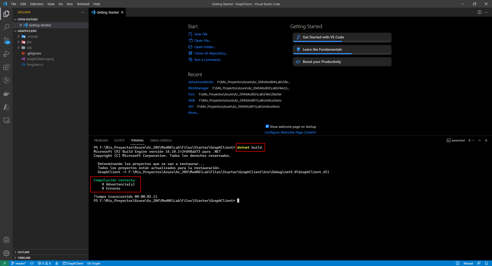


After update the Program class running the following command:
```
dotnet run
```
The browser window automatically opens the web page permissions requested.
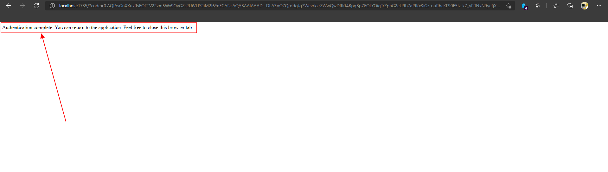


We visualize the access token.
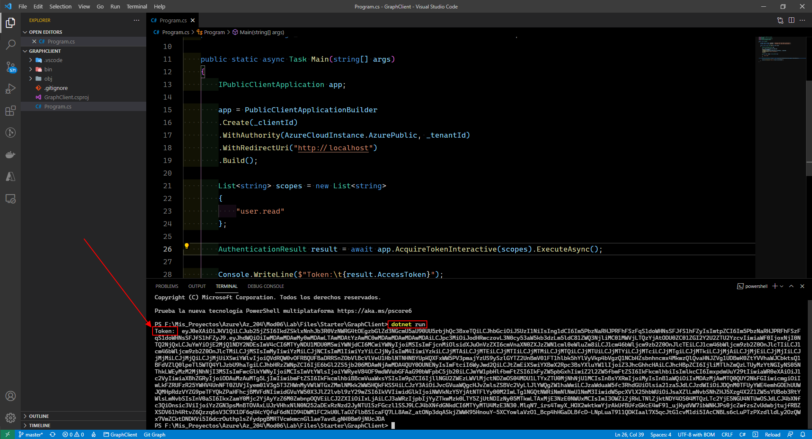


Enter the following command to import Microsoft.Graph from NuGet:
```
dotnet add package Microsoft.Graph
```
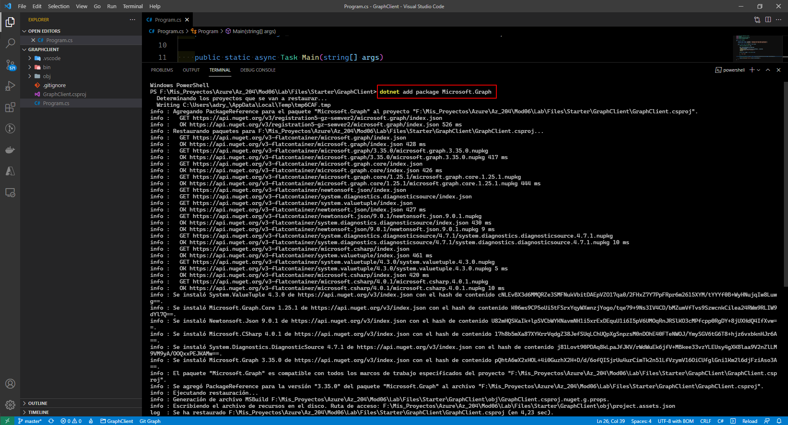


Enter the following command to import Microsoft.Graph.Auth from NuGet:
```
dotnet add package Microsoft.Graph.Auth
```
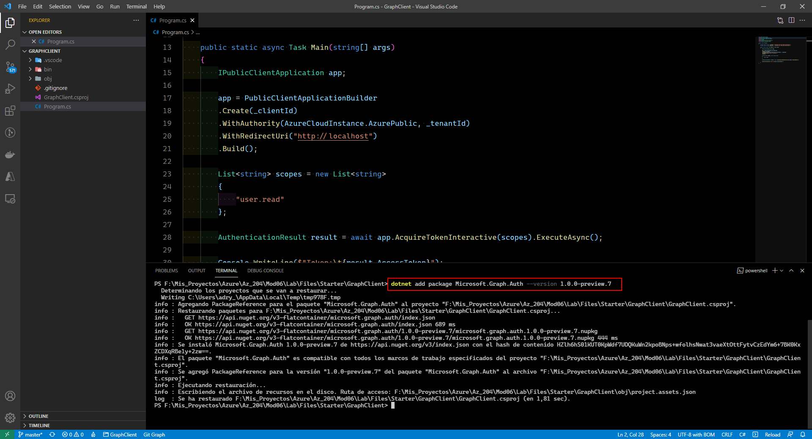


Enter the following command to build the .NET web application:
```
dotnet build
```
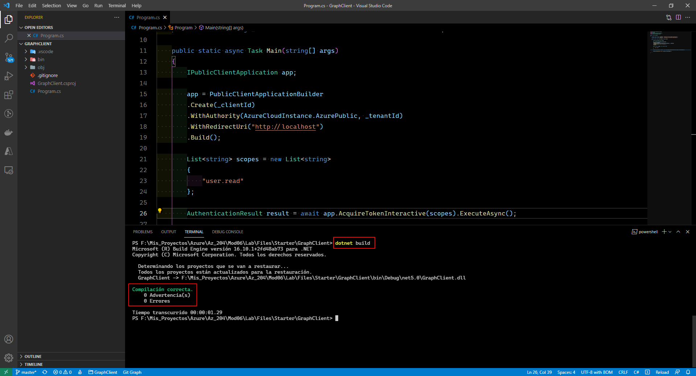


After update the Program class running the following command:
```
dotnet run
```
In an open browser window, go to https://microsoft.com/devicelogin.
and enter the code shown in the terminal.
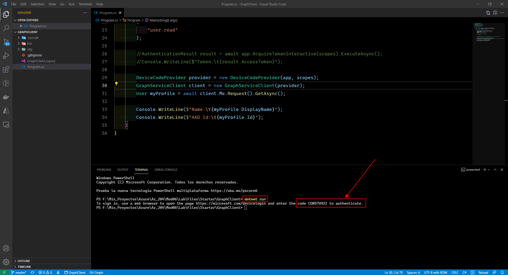


Paste code.
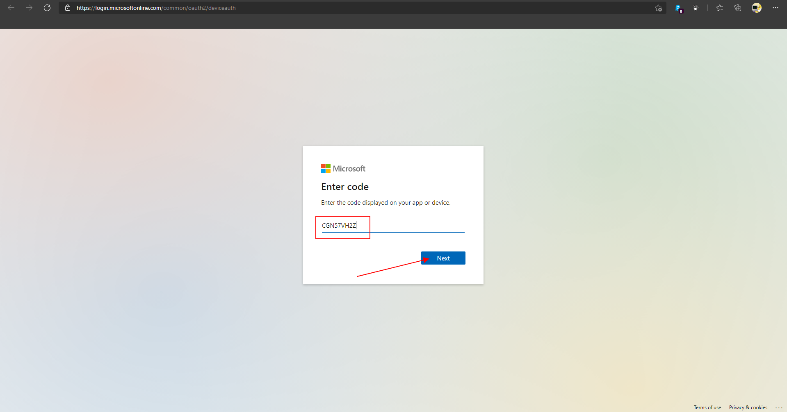


Correct code.
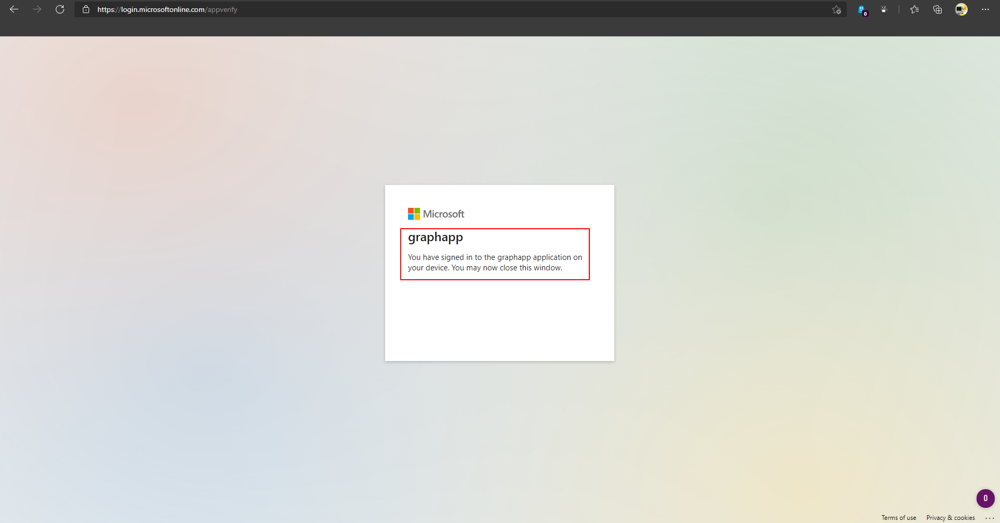


Application successfully registered within Azure Active Directory.
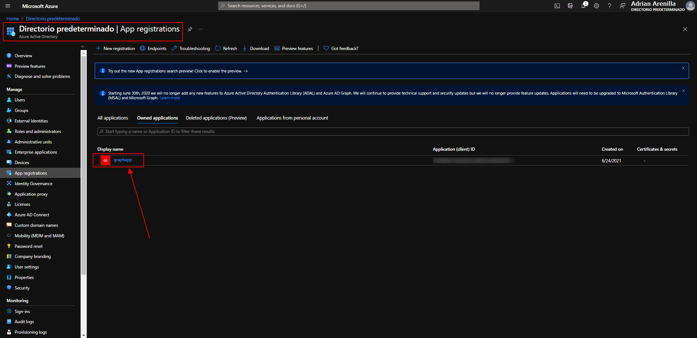


Delete the application registration in Azure AD.
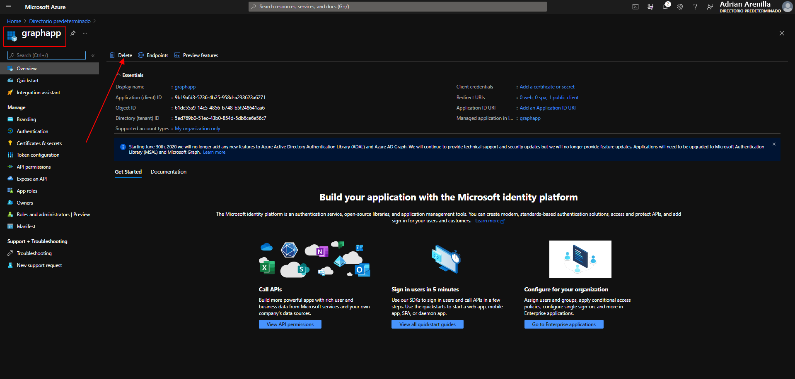


Delete the application registration in Azure AD.
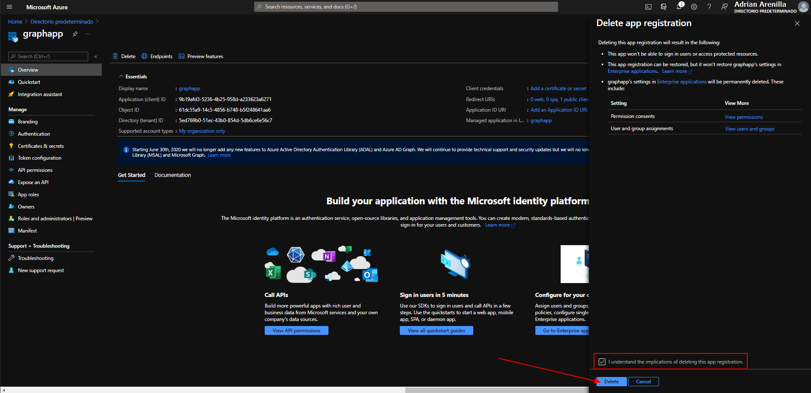


### [<-- Back to readme](../../readme.md)


