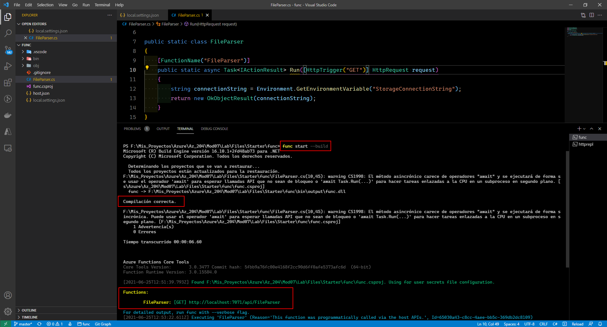

# Microsoft Az-204 (Adrián Arenilla Seco)

## Lab 07: Access resource secrets more securely across services
In this lab we will learn how to create an Azure key vault and store secrets in the key vault, create a system-assigned managed identity for an Azure App Service instance, create a Key Vault access policy for an identity or application from Azure Active Directory and use the Azure SDK for .NET to download a blob with an Azure role.

### [Go to lab instructions -->](Files/AZ-204_07_lab.md)

## Working Architecture


Create a storage account.


Create a key vault.


Create a functions app.


Configure a system-assigned managed service identity.


Create a Key Vault secret.


Configure a Key Vault access policy.


Configure a Key Vault access policy.


Key Vault access policy created successfully.


Create a Key Vault-derived application setting.


Enter the following command to use the Azure Functions Core Tools to create a new local Functions project in the current directory using the dotnet runtime:
```
func init --worker-runtime dotnet --force
```

Enter the following command to build the .NET Core project:
 ```
dotnet build
```


Enter the following command to create a new function named FileParser using the HTTP trigger template:
```
func new --template "HTTP trigger" --name "FileParser"
```


After update the FileParser class, enter the following command to run the function app project:
```
func start --build
```
We see that the function executes correctly.



Enter the following command to start the httprepl tool setting the base Uniform Resource Identifier (URI) to ``http://localhost:7071``:
```
httprepl http://localhost:7071
```


Enter the following command to publish the function app project:
```
func azure functionapp publish securefuncaas
```


Test the Key Vault-derived application setting.


Correct answer.


Create storage account containers.


Upload a blob into a container.


The JavaScript Object Notation (JSON) contents of the blob should now display.


Change access level policy to private.


An error message indicating that the resource wasn't found should now display.


Enter the following command to add Azure.Storage.Blobs package from NuGet:
```
dotnet add package Azure.Storage.Blobs
```


Update the FileParser class to write Azure Blob storage code using the Azure SDK for .NET.
Enter the following command to publish the function app project:
```
func azure functionapp publish securefuncaas
```


Test the function app.


Enter the following command to delete the ConfidentialStack resource group:
```
az group delete --name ConfidentialStack --no-wait --yes
```


### [<-- Back to readme](../../readme.md)


