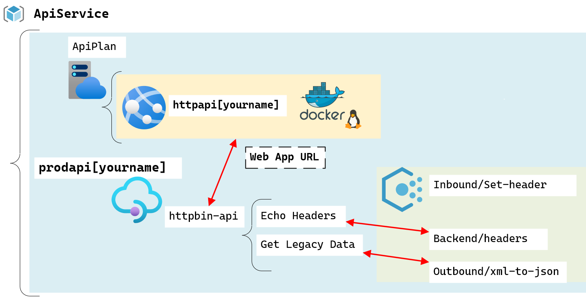
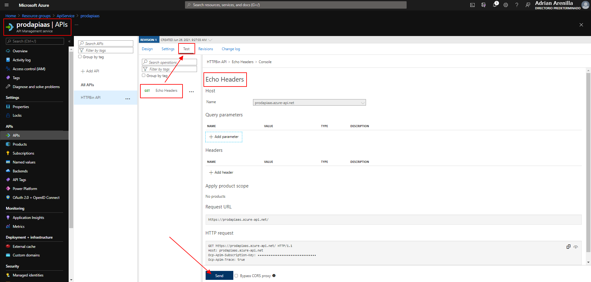

# Microsoft Az-204 (Adrián Arenilla Seco)

## Lab 08: Creating a multi-tier solution by using services in Azure
In this lab we will learn how to create a web application from a Docker Hub container image, create an API Management account, and configure an API as a proxy for another Azure service with header and payload manipulation.

### [Go to lab instructions -->](Files/AZ-204_08_lab.md)

## Working Architecture


Create a web app.


Test the httpbin web application.


Test the httpbin web application.


Test the httpbin web application.


Create an API Management resource.


Define a new API.


Define a new API.


Add operation to a new API.


Add policy to a new API.


Add request to a new API.


Test the API.



Observe the HTTP response.


Results created previously.


Manipulate an API response.


Test the API response.


Observe the HTTP response.


Replace that block of XML with the following XML:
```
<outbound>
     <base />
     <xml-to-json kind="direct" apply="always" consider-accept-header="false" />
</outbound>
```


The new results are in JavaScript Object Notation (JSON) format.


The new results are in JavaScript Object Notation (JSON) format.


The new results are in JavaScript Object Notation (JSON) format.


Enter the following command to delete the ApiService resource group:
```
az group delete --name ApiService --no-wait --yes
```


### [<-- Back to readme](../../../../)


