# Microsoft Az-204 (Adrián Arenilla Seco)

## Lab Logic Apps: Automate business processes with Logic Apps
In this lab we will learn how to create a workflow with the Logic App, manage products and APIs with the Logic App, and use Azure API Management as a proxy for the Logic App.

### [Go to lab instructions -->](Files/AZ-204_09_lab.md)

## Working Architecture
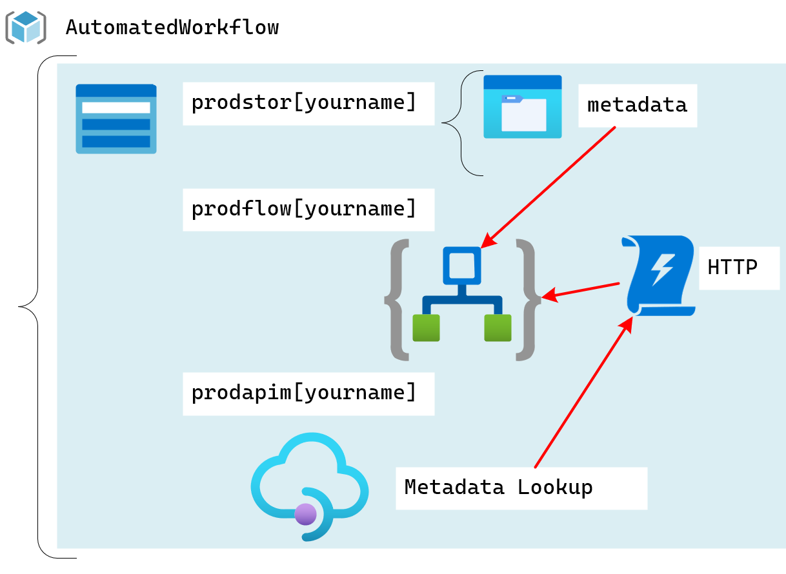

Create an API Management.
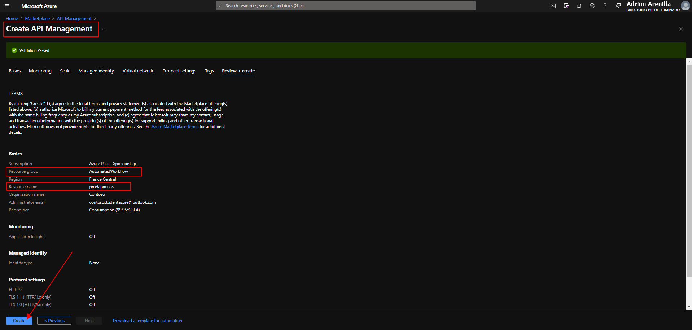


Create a Logic App.
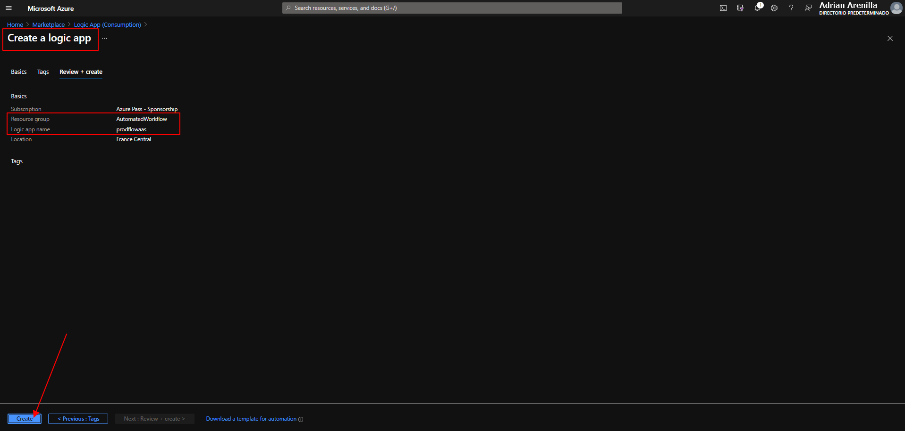


Create a storage account.
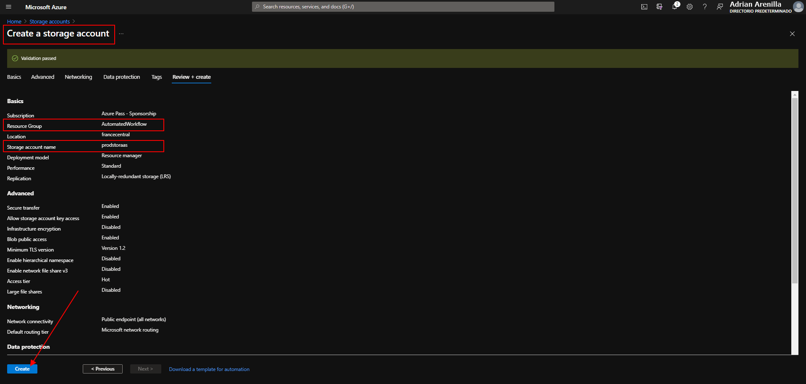


Upload sample content to Azure Files.
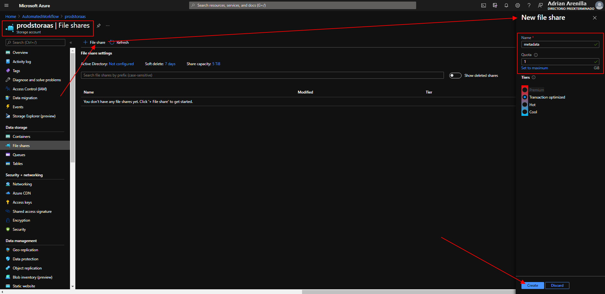


Upload files into a file share.
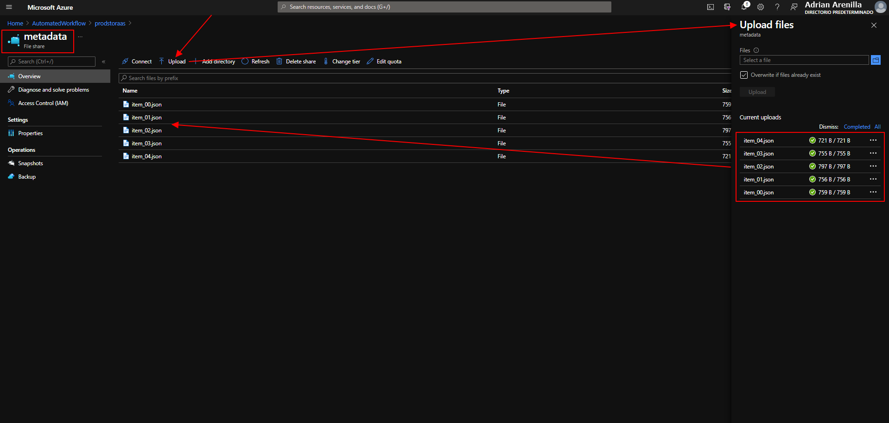


Create a trigger for the workflow.
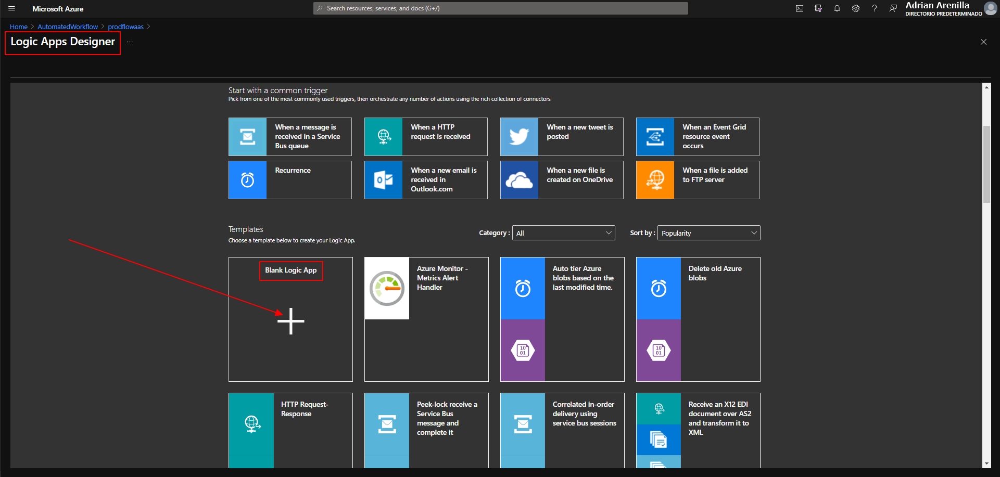


Select Request into Logic Apps DesignerS.
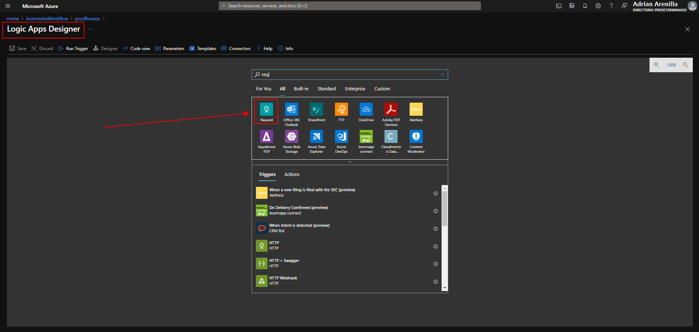


In the When a HTTP request is received within the method, select GET.
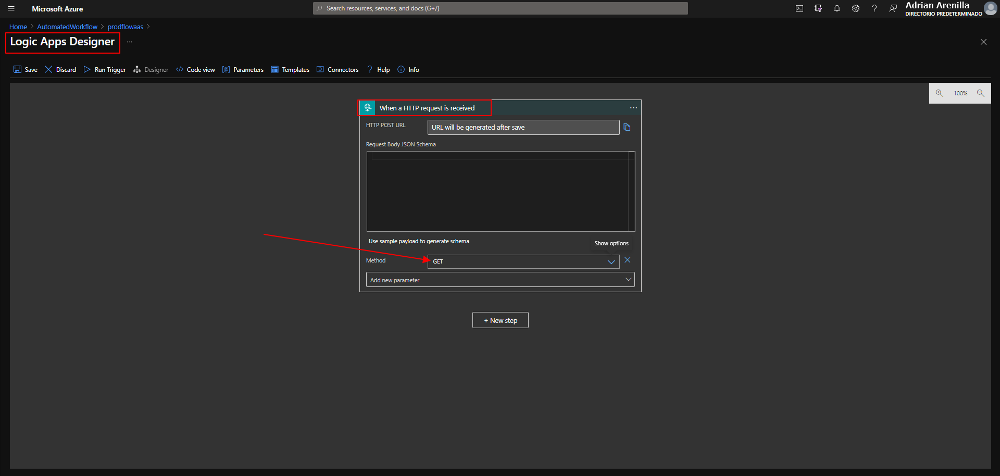


Create an action to query Azure Storage file shares. 
In the List files area, in the Folder text box, enter /metadata.
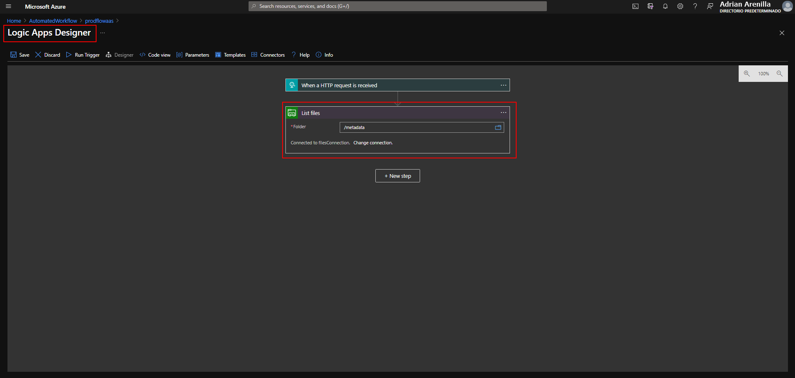


Create an action to project list item properties.
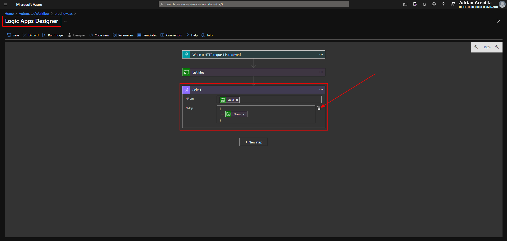


Build an HTTP response action.
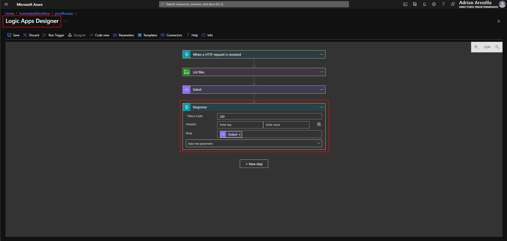


All workflow.
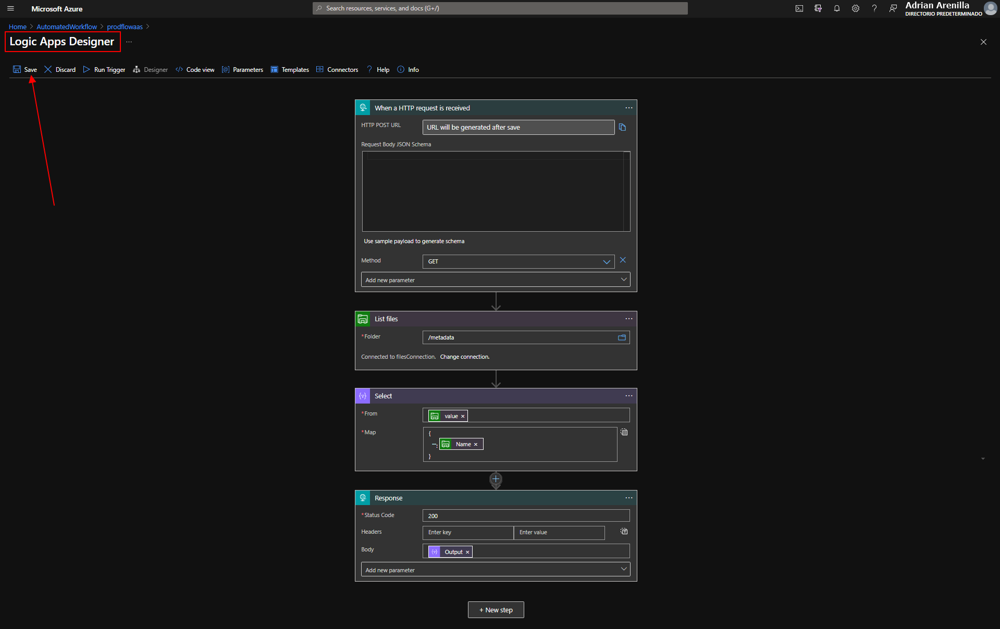


Create an API integrated with Logic Apps.
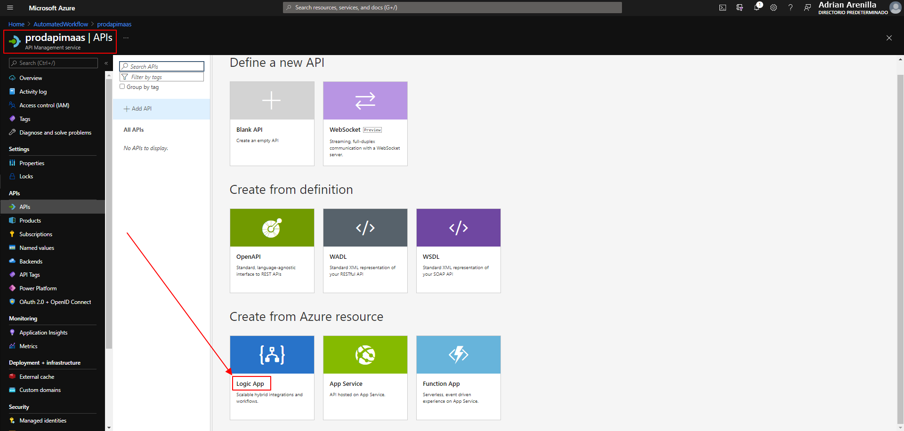


Create an API integrated with Logic Apps.
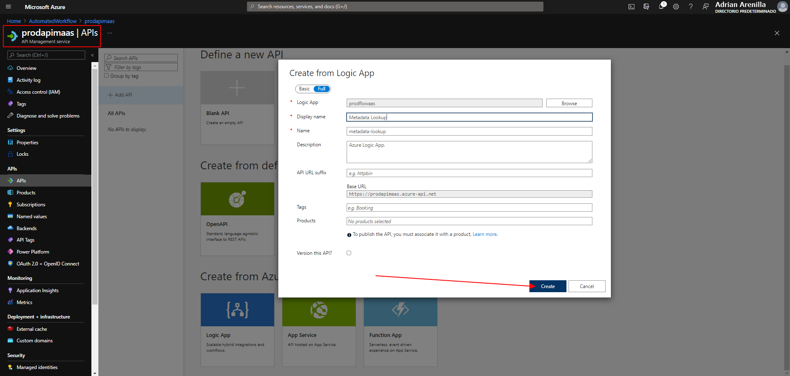


Test the API operation.
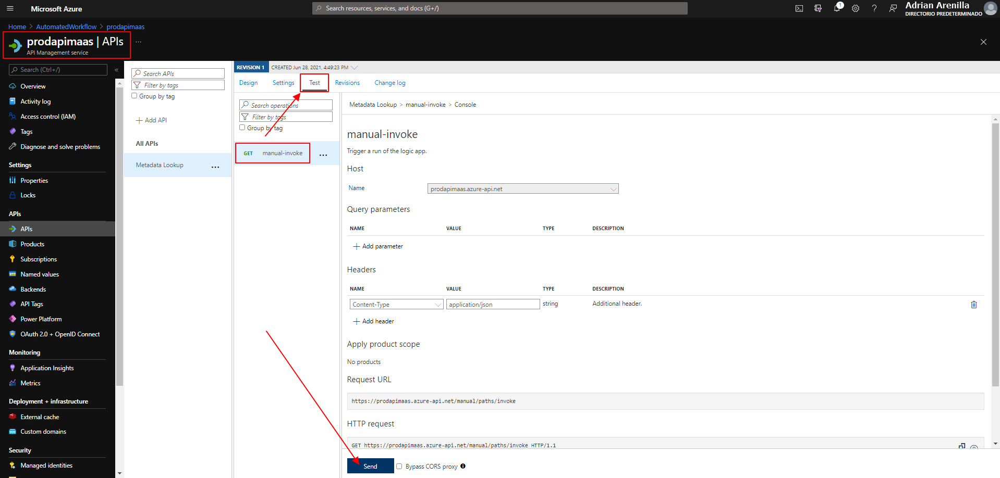


Test the API operation.
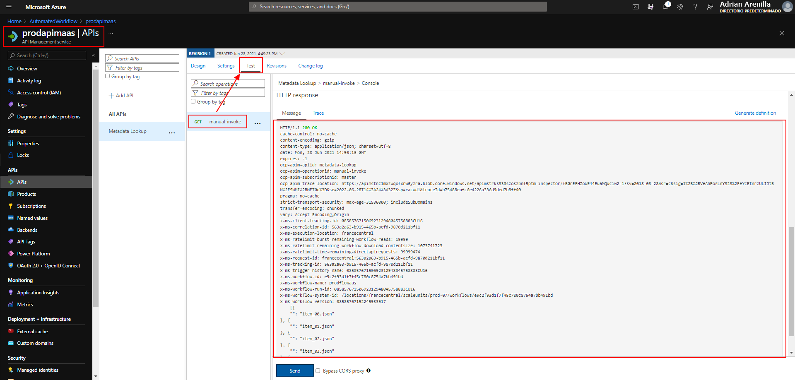


Enter the following command to delete the AutomatedWorkflow resource group:
```
az group delete --name AutomatedWorkflow --no-wait --yes
```
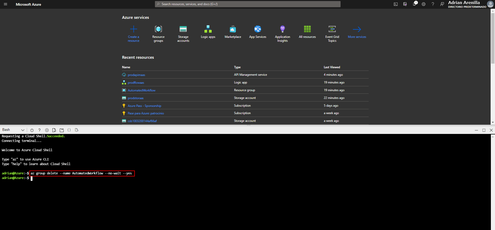


### [<-- Back to readme](../../../../)


