# Microsoft Az-204 (Adrián Arenilla Seco)

## Lab 10: Publishing and subscribing to Event Grid events
In this lab we will learn how to create an Event Grid topic, use the Azure Event Grid viewer to subscribe to a topic, and illustrate published messages and publish a message from a .NET application.

### [Go to lab instructions -->](Files/AZ-204_10_lab.md)

## Working Architecture


In Azure portal, at the Cloud Shell command prompt enter the following command to get the version of the Azure Command-Line Interface (Azure CLI) tool:
```
az --version
```
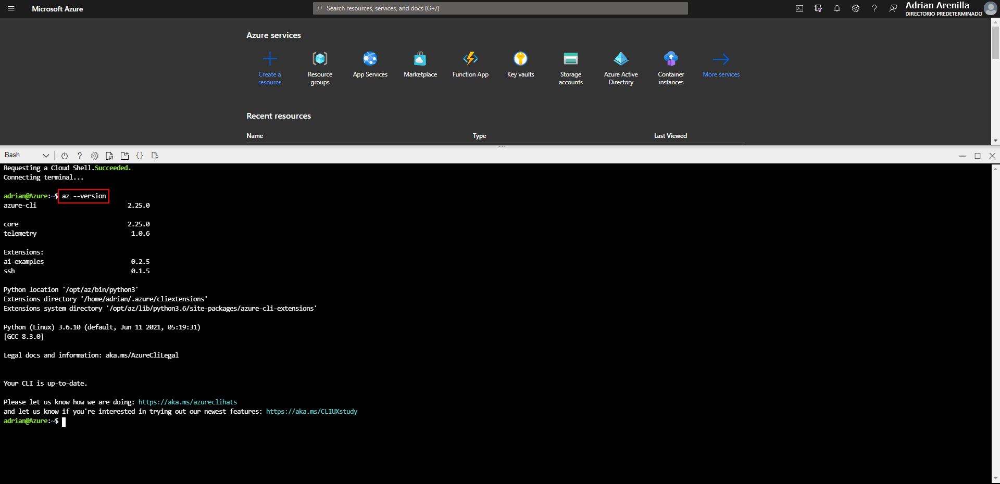


Enter the following command to list just the namespaces of the currently registered providers:
```
az provider list --query "[].namespace"
```
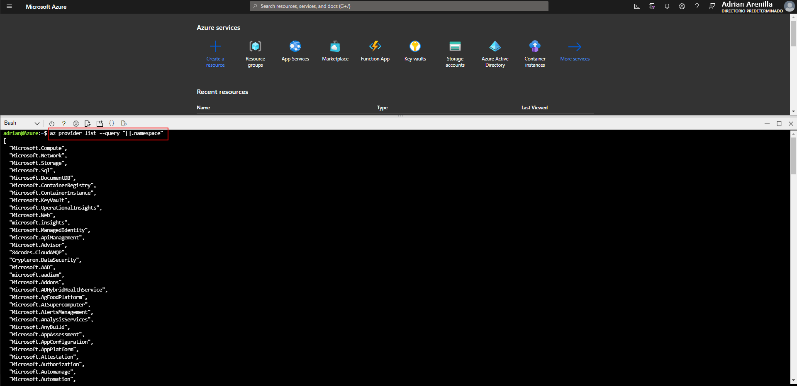


Review the list of currently registered providers. Notice that the Microsoft.EventGrid provider is currently included in the list of providers.
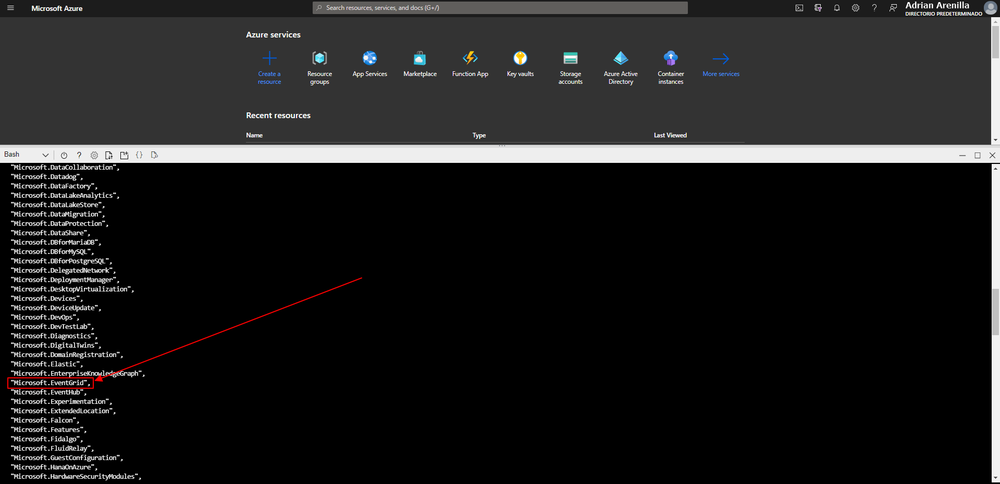


Create a custom Event Grid topic.
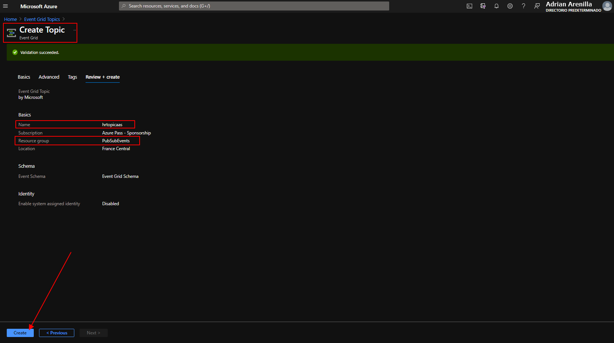


Deploy the Azure Event Grid viewer to a web app.
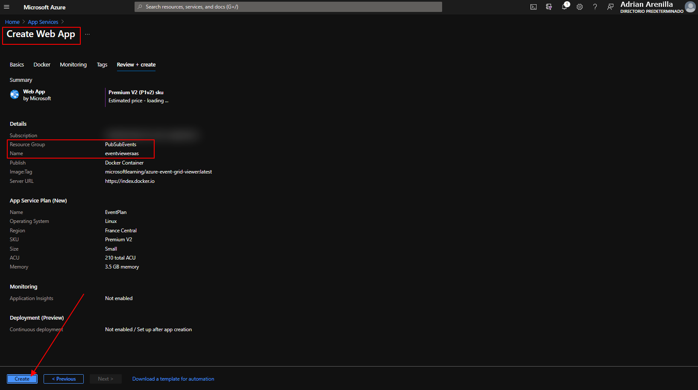


Access the Event Grid Viewer web application.
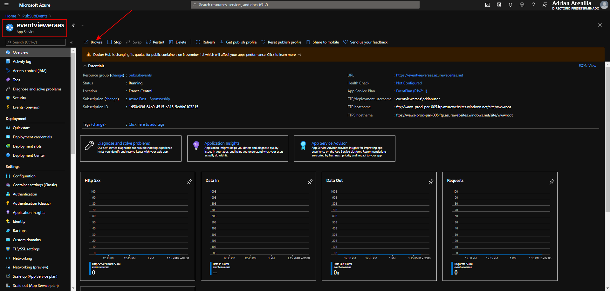


Observe the currently running Azure Event Grid viewer web application. 
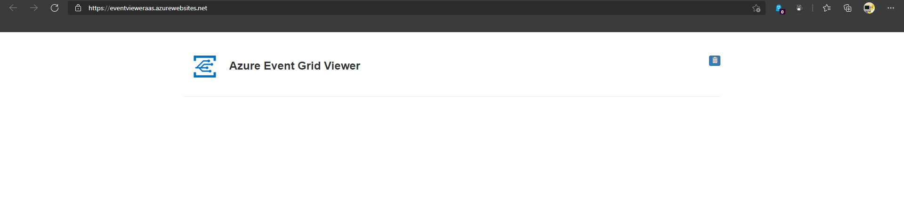


Create new subscription.
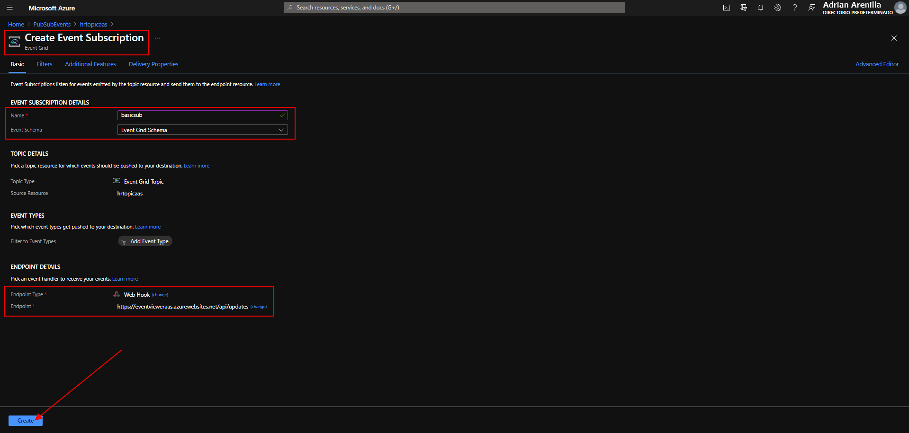


Observe the subscription validation event in JSON format.
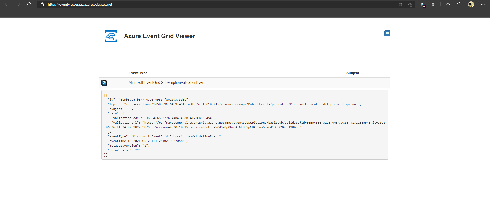


Enter the following command to create a new .NET project named EventPublisher in the current folder:
```
dotnet new console --name EventPublisher --output .
```
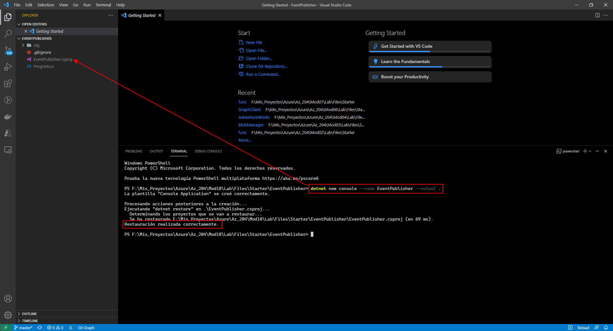


Enter the following command to import Azure.Messaging.EventGrid from NuGet:
```
dotnet add package Azure.Messaging.EventGrid
```
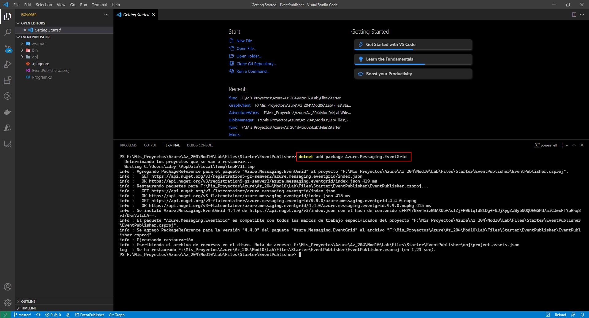


Enter the following command to build the .NET web application:
```
dotnet build
```
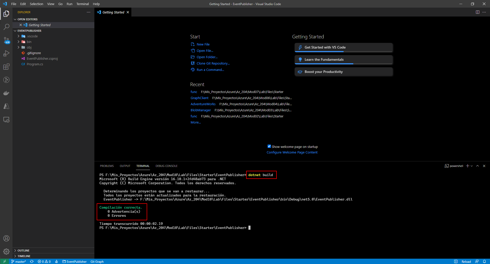


Update the Program class and enter the following command to run the .NET web application:
```
dotnet run
```
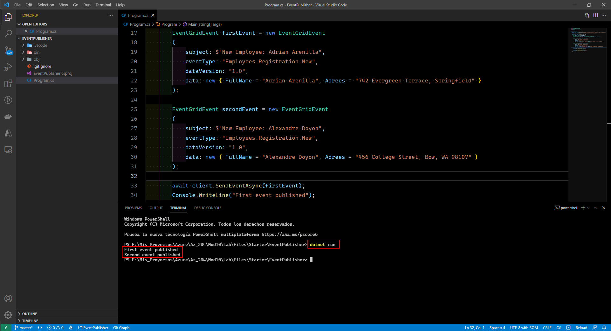


Observe published events in JSON format.
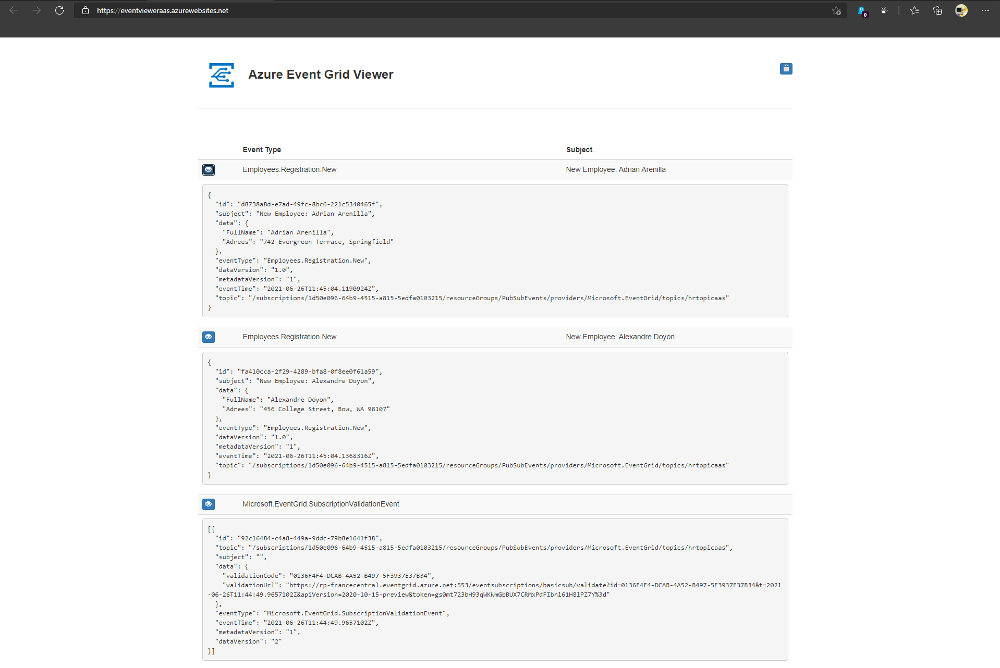


Enter the following command to delete the PubSubEvents resource group:
```
az group delete --name PubSubEvents --no-wait --yes
```
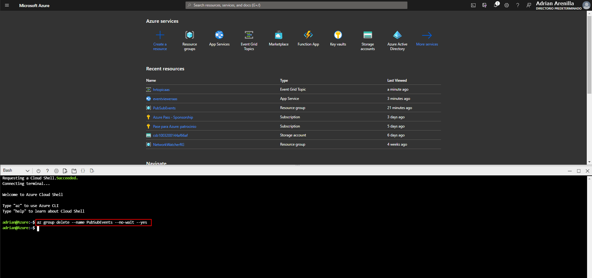


### [<-- Back to readme](../../readme.md)


