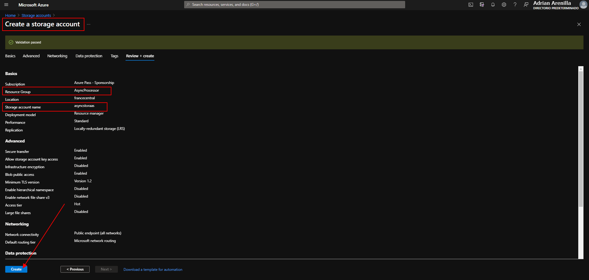
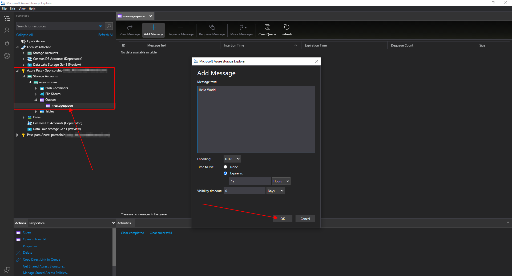
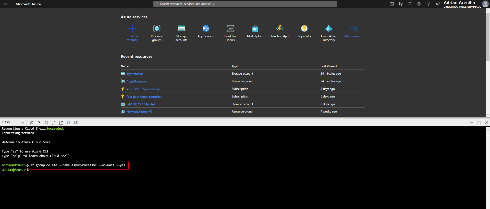

# Microsoft Az-204 (Adrián Arenilla Seco)

## Lab 11: Asynchronously processing messages by using Azure Queue Storage
In this lab we will learn how to add Azure.Storage libraries from NuGet, create a queue in .NET, generate a new message in the queue using .NET, consume a message from the queue using .NET, and manage a queue using Azure Storage Explorer.

### [Go to lab instructions -->](Files/AZ-204_11_lab.md)

## Working Architecture


Create a storage account.



Enter the following command to create a new .NET project named MessageProcessor in the current folder:
```
dotnet new console --name MessageProcessor --output .
```


Enter the following command to import *Azure.Storage.Queues from NuGet:
```
dotnet add package Azure.Storage.Queues
```


Enter the following command to build the .NET web application:
```
dotnet build
```


Update the Program class and enter the following command to run the .NET web application:
```
dotnet run
```


Update the Program class and enter the following command to run the .NET web application:
```
dotnet build
```


Enter the following command to run the .NET web application:
```
dotnet run
```


Open Azure Storage Explorer.


Add a message into Azure Storage Explorer.



Test message queue access. Enter the following command to run the .NET web application:
```
dotnet run
```


Update the Program class to delete queue messages.


View deleted queued messages using Storage Explorer.


Update the Program class to create queue new messages by using .NET. Enter the following command to run the .NET web application:
```
dotnet run
```


View queued messages by using Storage Explorer.


Enter the following command to delete the AsyncProcessor resource group:
```
az group delete --name AsyncProcessor --no-wait --yes
```



### [<-- Back to readme](../../readme.md)


