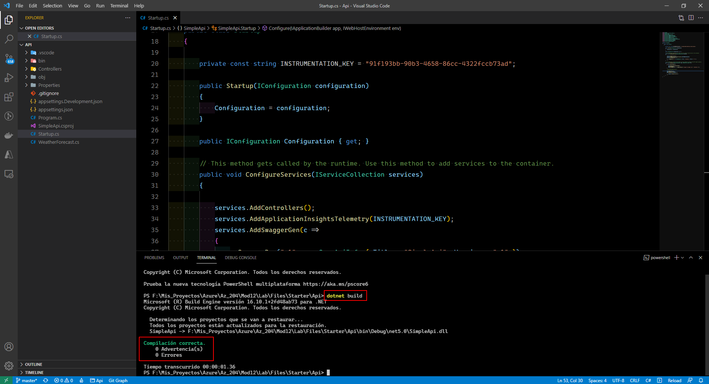

# Microsoft Az-204 (Adrián Arenilla Seco)

## Lab 12: Monitoring services that are deployed to Azure
In this lab we will learn how to create an Application Insights resource and integrate Application Insights telemetry tracking into an ASP.NET web application and a resource created with Azure App Service Web Apps.

### [Go to lab instructions -->](Files/AZ-204_12_lab.md)

## Working Architecture


Create an Application Insights resource.


Create a web app by using Azure App Services resource.


Configure web app autoscale options.


Save configuration options.


Enter the following command to create a new .NET Web API application named SimpleApi in the current directory:
```
dotnet new webapi --output . --name SimpleApi
```


Enter the following command to import Microsoft.ApplicationInsights from NuGet to the current project:
```
dotnet add package Microsoft.ApplicationInsights
```


Enter the following command to import Microsoft.ApplicationInsights.AspNetCore from NuGet:
```
dotnet add package Microsoft.ApplicationInsights.AspNetCore
```


Enter the following command to import Microsoft.ApplicationInsights.PerfCounterCollector from NuGet to the current project:
```
dotnet add package Microsoft.ApplicationInsights.PerfCounterCollector
```


Enter the following command to build the .NET web app:
```
dotnet build
```


Update Startup class and enter the following command to build the .NET web app:
```
dotnet build
```



First enter the following command to run the .NET web application.
```
dotnet run
```
After go to the /weatherforecast relative path of your test application that's hosted at localhost on port 5000.


Get metrics in Application Insights.


Enter the following command to list all the apps in your MonitoredAssets resource group:
```
az webapp list --resource-group MonitoredAssets
```


Enter the following command to deploy the api.zip file to the web app:
```
az webapp deployment source config-zip --resource-group MonitoredAssets --src api.zip --name smpapiaas
```


In the browser address bar, update the URL by appending the suffix /weatherforecast to the end of the current URL.


Configure in-depth metric collection for Web Apps.


Get updated metrics in Application Insights.


View real-time metrics in Application Insights.


Enter the following command to delete the MonitoredAssets resource group:
```
az group delete --name MonitoredAssets --no-wait --yes
```


### [<-- Back to readme](../../readme.md)


